# Asterinas 在 Milk-V Megrez 上的启动指南与工程复盘

> **历史快照（冻结于 2026-07-20）：** 本文保留概念、实验过程和工程复盘，
> 不再维护实时状态或当前命令。请从[唯一实时状态入口](README.md)继续。

> 状态：启动、PID 1 与软件恢复证据更新至 2026-07-20。
>
> 当前交接协作分支：`codex/megrez-porting-handoff`。
>
> 冻结 QEMU 软件恢复证据：`7f691c479df1b5319f71a6ad738f36541d90ca54`，
> 来源分支为 `codex/riscv-software-reboot`；它是 provenance，不是当前
> 接手分支。
>
> 历史 clean QEMU 启动基线：`593d5bb19d5da8520b0c81c71743575840419a78`。
> 该提交不含 `asterinas.reboot_after` 或 OSTD emergency restart，
> 不得用于软件恢复实验。
>
> 最新受控真机证据：
> [`3ef99e6bd` PID 1 与恢复结果](evidence/2026-07-20-megrez-pid1-recovery.md)。
>
> 最近一次 Megrez 真机源码：`3ef99e6bd15341578b32256c897050e873ca2547`。
>
> 这是一份移植开发文档，不是已经完成的板级支持声明。

新协作者应先阅读[一页式移植交接](README.md)。
本长文保留概念、历史证据、踩坑复盘和真机 runbook。

## 1. 先看结论

Asterinas 要在 Megrez 上进入用户态，
必须依次打通构建产物、U-Boot 镜像协议、早期页表、OSTD、内核初始化、initramfs 和 PID 1。
QEMU 成功只证明架构通路和大部分软件逻辑可用，
不能替代真实 EIC7700 CPU、固件、内存和设备树的验证。

当前协作分支已经完成以下工作：

- RISC-V 内核能够构建；
- 直接 QEMU 能进入 OSTD、准备 rootfs，并执行 PID 1；
- ELF 内部已经链接标准 RISC-V Linux Image v0.2 头；
- 能生成经过严格布局检查的 U-Boot `booti` 平坦镜像；
- QEMU 已运行真实的 OpenSBI → 通用 U-Boot → 唯一一次 `booti` 链；
- 4-hart 默认 Sv48 已在 QEMU 的 Svade/Svadu 两端到达用户态；
- stale RAM bootargs 已在 U-Boot/QEMU 精确复现 init ENOENT，修正后到达用户态；
- 冻结恢复证据分支已在 QEMU 的真实通用 U-Boot `booti` 流程中分别通过
  timer 与 panic 重启，均只发送一次 `booti`、进入新的固件周期且启动盘不变；
- RISC-V 启动页表、内核映射与受跟踪用户页已经补充或修复 A/D 位处理；
- `6df0f28f` 默认 Sv48 已在 Megrez 真机进入 OSTD、启动三个 AP、选择
  时间戳随机源并解包 rootfs。
- `3ef99e6bd` 已在 Megrez 真机进入 PID 1，完成首次 50 字节用户态
  `write`，并在同一受控会话中观察到新的 OpenSBI、U-Boot 与 prompt。

当前仍未完成的工作：

- UART 日志中没有普通用户态 hello；真实 DTB 的 DesignWare UART 还没有
  被当前 RISC-V UART 组件匹配；
- Asterinas 尚未接收 U-Boot 已初始化的 framebuffer，`tty0` 输出会被
  无 framebuffer 的 VT backend 丢弃；
- 当前最小 initramfs 只用于诊断，不包含可交互 shell；
- Megrez 的 USB host/HID keyboard 链路尚未实现，物理 USB 键盘不是本轮
  显示 console 目标的一部分；
- EIC7700、厂商 OpenSBI/U-Boot、真实 DTB、PMP、缓存和板级设备仍未被 QEMU 模拟；
- 板载 WDT0 没有证明能从卡死内核自动复位，真机实验仍需要外部恢复能力。

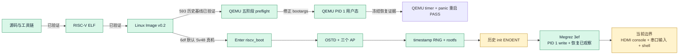

### 1.1 本文的证据标签

为了不把推测写成事实，
本文使用三种标签：

| 标签 | 含义 | 示例 |
|---|---|---|
| **已验证** | 有源码、构建结果或原始串口证据直接支持 | `6df0f28f` 真机到达 `[kernel] rootfs is ready` |
| **合理推断** | 与已有证据一致，但还缺少同一对象的单变量实验 | U-Boot scanout 可以复用，但 format/cache 仍须真机证实 |
| **尚未验证** | 是后续目标，不能写成当前能力 | HDMI 显示交互 shell，或物理 USB 键盘输入 |

### 1.2 当前完成度

| 边界 | direct fast QEMU | U-Boot fast QEMU | `6df0f28f` Megrez | `3ef99e6bd` Megrez |
|---|---:|---:|---:|---:|
| 生成/接受 Image | ✅ | ✅ | ✅ | ✅ 冻结身份并完成一次 `booti` |
| `Enter riscv_boot` | ✅ | ✅ | ✅ | ✅ |
| `OSTD initialized` | ✅ | ✅ | ✅ | ✅ |
| 三个 AP 与组件初始化 | ✅ | ✅ | ✅ | ✅ |
| 时间戳随机源 | ✅ | ✅ | ✅ | ✅ |
| rootfs ready | ✅ | ✅ | ✅ | ✅ |
| PID 1 marker | ✅ | ✅（修正路径） | ❌ init ENOENT | ✅ 首次 `write` 返回 50 |
| 软件恢复 | — | ✅ timer/panic（`7f691c479`） | — | ✅ 观察到新固件周期与 prompt |
| HDMI console / shell | — | — | — | ❌ 尚未接收 framebuffer，诊断 init 也不是 shell |

历史 v8 和 `ae38e6c6` 仍是定位过程的重要证据，但已不代表最新真机边界。
`6df0f28f` 证明默认 Sv48 和 A/D 修复后的路径能在 Megrez 到 rootfs；
`593d5bb19` 则证明纠正后契约下的最终模拟矩阵与 bootargs 修正。两者不是
同一 Image，
最新 `3ef99e6bd` 则把 PID 1 与恢复边界推进到了真机。下一步只处理
framebuffer、console route、串口输入与 shell，不再把 PID 1 之前的阶段
列为当前阻断。

## 2. 先理解三个世界

整个移植横跨三个彼此不同的世界。
许多误判都来自把其中一个世界的成功外推到另外一个世界。

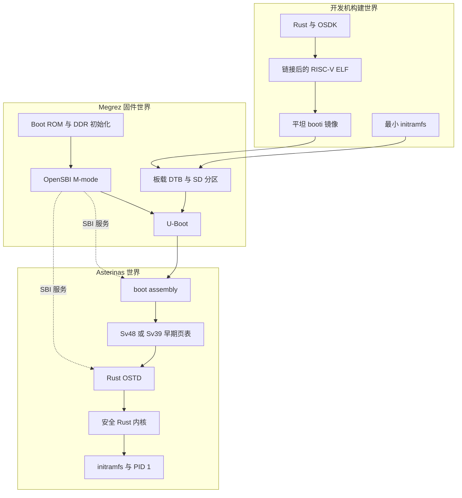

开发机负责产生可审计的字节。
U-Boot 负责把这些字节放到约定的物理地址并传递 DTB。
Asterinas 必须在 S-mode 中建立自己的地址空间，
同时继续通过驻留在 M-mode 的 OpenSBI 使用控制台、定时器和系统复位服务。

## 3. 从上电到 PID 1 的完整启动链

Megrez 上电后，
并不是直接运行 Asterinas。
实际控制权会经过多层固件。

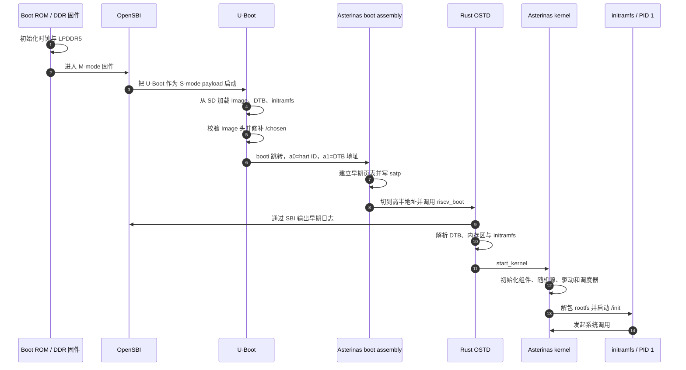

### 3.1 OpenSBI 的角色

OpenSBI 驻留在 M-mode。
它向 Asterinas 提供标准 SBI 服务，
例如控制台输出、定时器、核间中断和系统复位。

在历史 v8 日志中，
OpenSBI 1.5 报告了 4 个 HART，
并声明系统复位设备为 `eswin_eic770x_reset`。
这证明 SBI 复位服务在固件描述层存在，
但不等于硬件 WDT 一定能独立复位已经卡死的系统。

### 3.2 U-Boot 的角色

U-Boot 不理解 Asterinas 内部逻辑。
它只负责：

1. 读取平坦 Linux Image；
2. 检查 RISC-V Image 头；
3. 读取 DTB 与 initramfs；
4. 在 `/chosen` 写入启动参数和 initramfs 范围；
5. 跳转到 Image 入口。

所以出现 `Starting kernel ...` 代表 U-Boot 接受了三个输入并完成跳转。
它不代表 Asterinas 已经建立页表，
更不代表 Rust、OSTD 或用户态已经运行。

### 3.3 Asterinas 内部的目标路径

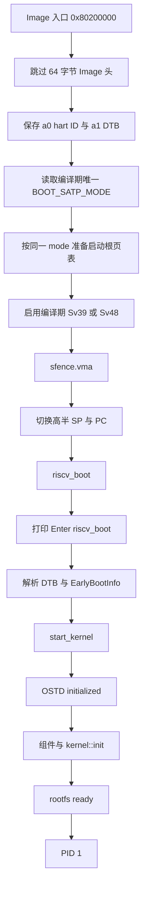

自 `b48cfeea3` 起，启动汇编不再独立执行 Sv48-first fallback。BSP、AP、
Rust `PagingConsts` 和最终页表必须遵循同一个编译期 paging mode。此前的
独立 fallback 曾在 Sv39 编译的内核上成功启用 Sv48，并在第一次 DTB 读取
时制造跨布局 page fault。

`ae38e6c6` 曾在 U-Boot 跳转后完全无输出，因而当时合理怀疑第一次地址
空间切换。后续 `6df0f28f` 使用默认 Sv48 在真机打印 `Enter riscv_boot`，
完成 OSTD、三个 AP、组件和 rootfs，已经证明该假设不是当前主阻塞点。
默认 Sv48 仍有历史真机证据；当前 Debian 存储路径则明确构建为 Sv39。
两种模式必须是独立产物和独立门禁，不能在同一 Image 内由汇编自行切换。

## 4. 四类启动产物

真机启动需要四类输入。
缺少任何一类，
都不可能完成端到端启动。

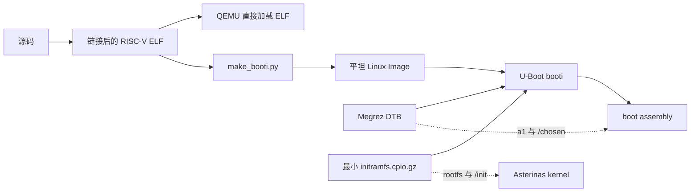

### 4.1 RISC-V ELF

ELF 保留段、符号、虚拟地址和物理加载地址。
QEMU 开发路径直接使用 ELF，
所以它天然知道每个符号应放在哪里。

### 4.2 平坦 Linux Image

U-Boot `booti` 使用平坦 Image，
不会像 ELF loader 一样按段和符号重新布局。
因此文件偏移必须与链接时的物理布局严格一致。

当前工具 `tools/riscv/make_booti.py` 的原则是：

- Image 头必须已经链接在 ELF 内；
- 工具只验证、抽取和补零；
- 工具不能在文件前面再插入 64 字节；
- 输出通过临时文件、`fsync` 和原子替换产生；
- 输出长度必须等于头部 `image_size`。

### 4.3 DTB

DTB 描述内存、CPU、PLIC、UART、保留内存和 `/chosen`。
真机使用 RockOS 自带的 Megrez DTB，U-Boot 将它加载到 `0xf0000000`。
当前已在板上现场审计其结构，但原始 DTB 文件未入库；仓库只保留大小、
CRC 和提炼后的结构契约。QEMU preflight 使用的是按 profile 生成并净化的
`virt` DTB，不会也不能执行真实 Megrez DTB。

`/chosen` 至少需要承载：

- `bootargs = "loglevel=info init=/init"`；
- U-Boot 根据 initramfs 自动写入的 `linux,initrd-start`；
- U-Boot 根据 initramfs 自动写入的 `linux,initrd-end`。

这里的 `bootargs` 是不带临时恢复参数的稳定启动基线。历史
`3ef99e6bd` 受控实验曾按 10.2 和 18.3 节临时追加
`asterinas.first_process_diag=1` 和 `asterinas.reboot_after=400`；该值
不是下一轮显示 console 候选可以直接粘贴的当前命令。

U-Boot 执行 `booti` 时，
会用非空 RAM 环境变量 `bootargs` 覆写 DTB 中的 `/chosen/bootargs`。
因此不能只修改 DTB；
RAM 环境和 DTB 必须使用本轮选择的同一份板端参数。

### 4.4 initramfs

initramfs 是压缩的 CPIO 文件系统。
`3ef99e6bd` 的 570 字节诊断镜像包含一个 RISC-V 用户态 `/init`，只用于
输出 marker 和持续自旋，不包含交互 shell。

以下 marker 是历史 QEMU 的可见用户态边界：

```text
>>> Hello from RISC-V userspace on Asterinas! <<<
```

最新真机虽然没有显示这行普通 hello，但 PID 1 诊断已经证明第一次
`write(fd=1, requested=50)` 成功返回。因此当前工作是换入 BusyBox shell
并建立物理 console，而不是继续证明能否进入用户态。

仅看到 OSTD 或内核 banner 还不够。

## 5. Image 头为什么必须“链接在原位”

这是本次移植中已经犯过并修正的关键错误。

历史 v3 工具曾把 64 字节头直接拼接到已经链接好的 raw image 前面。
这样虽然让 U-Boot 看到了合法 header，
却把所有启动代码和页表整体向后移动了 `0x40`。

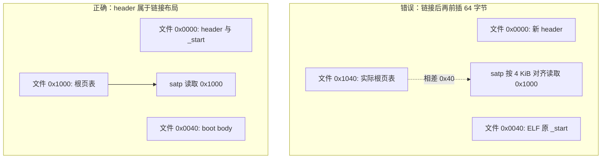

历史 v3 在启用 `satp` 后立即静默，
与根页表错位完全吻合。
当前实现把固定宽度的 `jal x0,+0x40` 放在 Image 头第一个 word，
执行时跳过剩余 header，
而页表仍保持链接器约定的 4 KiB 对齐。

当前 Image 布局：

```text
文件偏移 0x0000..0x003f   RISC-V Linux Image v0.2 头
文件偏移 0x0040..         BSP boot body
文件偏移 0x1000           Sv48 根页表
文件偏移 0x3000           Sv39 根页表
其余字节                   内核 payload
尾部                       补零到 __kernel_end
```

## 6. 历史 `ae38e6c6` 真机实验的内存布局

Megrez DRAM 从 `0x80000000` 开始，
总大小 16 GiB。
2026-07-15 的一次性测试使用以下布局。

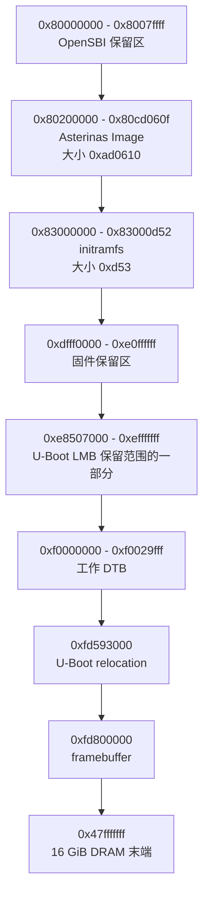

这些地址通过当次 `bdinfo`、文件大小和 U-Boot 输出验证。
其中 DTB 地址位于 U-Boot 标记的宽泛 LMB 保留范围内，
但历史 RockOS、v8 和当前 `booti` 都使用了该位置，
且扩容后末端 `0xf0029fff` 仍远低于 U-Boot relocation 地址。

不能把这些地址无条件复制到另一块板或另一版固件。
每次测试都必须重新执行 `bdinfo` 和范围检查。

## 7. 从构建到真机的分层门禁

正确流程不是“编译一次，然后反复上板试”。
每一层只回答一个更窄的问题。

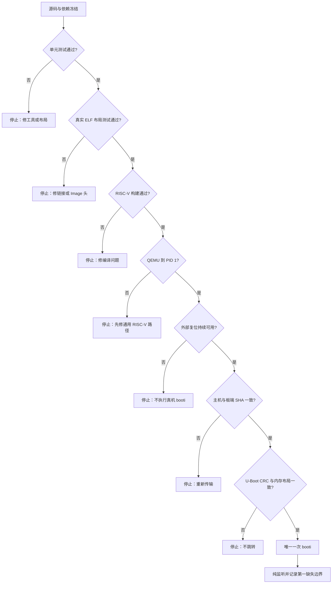

### 7.1 构建

所有构建应在项目规定的开发容器中完成，
并使用仓库 `rust-toolchain.toml` 固定的工具链。

Megrez 的历史通用启动路径以默认 Sv48 到达过 rootfs；当前持久 Debian/MMC
路径则显式启用 `riscv_sv39_mode`。这两条证据都有效，但产物不得混用。
构建必须在文件名、manifest 和启动日志中标明 paging mode，并由
`BOOT_SATP_MODE` 保证 BSP/AP 与 Rust layout 一致。

标准 ELF 位于：

```text
target/osdk/aster-kernel-osdk-bin.qemu_elf
```

### 7.2 生成 `booti` Image

Image 必须由已明确 paging mode 的链接后 ELF 生成，并通过 header、偏移、
对应模式根页表、长度和哈希门禁。精确构建、转换与测试命令只维护在
[`tools/riscv/README.md`](../../tools/riscv/README.md)，避免本指南再次漂移。

### 7.3 QEMU 门禁

当前 fast preflight 必须使用与当前 HEAD 和 UTC 时间绑定的新目录；唯一可
执行命令保留在 `tools/riscv/README.md`，本文只解释门禁语义，避免复制命令
后产生漂移。

结果固定为 `stages=6, probes=1`。六个 stage 必须按以下顺序完成：

1. `candidate`：从当前 Git HEAD 构建并冻结候选身份；
2. `direct-svade`：4-hart、2 GiB、Sv48/Svade direct QEMU 到用户态 marker；
3. `direct-svadu`：4-hart、2 GiB、Sv48/Svadu direct QEMU 到用户态 marker；
4. `uboot-stale-bootargs`：真实通用 U-Boot `booti` 精确复现 stale RAM
   bootargs 的 init ENOENT；
5. `uboot-positive`：同一候选在修正 RAM bootargs 后经 `booti` 到用户态
   marker；
6. `uboot-first-process-console-loss`：运行固定的
   `first-process-console-loss` 变体，并得到
   `EXPECTED_CONSOLE_ROUTE_LOSS`。

在 `uboot-positive` 和第六个 stage 之间还必须运行独立的
`uboot-registered-console-suppression` probe。它不占用第六个 stage 的编号，
也不能被省略或替换成自由配置的 scenario。

每个正向 stage 都必须观察 `Enter riscv_boot`、三个 AP、OSTD、时间戳
随机源、rootfs 和唯一 marker，且不得出现 panic/fault。当前最小 `/init`
自行打开 `/dev/ttyS0`，打印 marker 后保持运行；runner 在命中 marker 后
终止并清理整个 QEMU 进程组，不再依赖 init 退出造成的 panic。

fast profile 的 2 GiB 不等于真机 16 GiB。16 GiB direct profile 只有在显式
opt-in、可用内存和 swap 门禁通过时才会启动；资源不足必须分类为 skip，
而不是降低门槛。通用 Sv39/U-Boot 测试仍保留为底层回归，但不再代表完整
Megrez preflight。所有精确命令和证据字段仍以工具文档为准。

#### 7.3.1 第一进程 console-loss 诊断

临时诊断参数是 `asterinas.first_process_diag=1`；默认关闭，且只有注册
console registry 为空时才激活。真机保留可用 UART 时，必须同时显式传入
`asterinas.first_process_diag_force=1`，激活 marker 会记录
`console_registry=registered`；force 参数单独出现不会激活诊断。suppression
probe 保留普通 `ns16550a`
payload UART，要求观察到 NS16550A console 注册、正常用户态 marker，并且
诊断前缀计数为零。console-loss stage 则只把 payload DTB 的 UART compatible
改成 `snps,dw-apb-uart`，其 terminal marker 必须精确证明
`fd=1 requested=50 result=50`，普通用户态文本必须为零。

这不是 SoC 模拟：整个变体中 machine DT 保持不变，只有交给 Asterinas 的
payload DTB 发生上述一个语义变化。因此固件和 U-Boot console 仍可见，
但该实验不模拟 EIC7700 UART、中断、时钟、复位、PMIC 或 watchdog。
QEMU PASS 不授权真机启动，也不能证明 Megrez 上的 UART MMIO 契约成立。

串口记录只能按最后一条有效 marker 缩小边界：

| Last evidence | 解读 |
|---|---|
| no `diagnostic_active` | registry 非空且未 force、参数缺失或 SBI sink 不可用；不能据此推断 PID 1 边界 |
| `process_components_ready` only | 第一进程的设备初始化没有返回 |
| `device_init_ready` only | 标准 I/O 初始化没有返回 |
| `stdio_init_ready` only | PID 1 task 没有到达第一次 U-mode 入口 |
| `user_enter` only | U-mode 没有通过预期 task 路径返回内核 |
| `user_first_return` only | 已发生第一次返回；后续判断仍需 return reason 与可选 fault pair |
| page-fault outcome `fault_signal_queued` | VMAR handler 没有解决 fault，既有 fault-signal 路径已运行 |
| `user_page_fault_repeated` | 同一个初始 page fault 再次返回 task loop |
| resolved page-fault pair but no syscall | 初始 fault 已解决，但 PID 1 未到达 syscall |
| `user_first_syscall` but no terminal write | PID 1 到达初始 syscall，但 write 未在期限内完成 |
| successful `user_first_write_returned` with no userspace text | 确定性 write 已完成，console 可见性成为已直接复现的首要解释 |
| userspace text appears in the console-loss variant | 预测的 console loss 没有发生，因此该 scenario 失败 |

缺少更晚的 marker 只能缩小最后完成边界，不能单独证明该边界内部的根因。

### 7.4 产物身份

每个真机实验都要冻结：

- Git commit；
- ELF SHA-256；
- Image SHA-256 和 CRC32；
- initramfs SHA-256 和 CRC32；
- Image 字节数；
- DTB 文件路径；
- 所有 U-Boot 加载地址；
- 原始串口日志路径。

这样才能回答“这次测试的到底是哪一份字节”。

## 8. 真机准备与传输

真机阶段有两个目标：

1. 不破坏板上已有的 RockOS 和历史镜像；
2. 在 `booti` 之前尽可能把所有错误挡在外面。

### 8.1 串口必须只有一个所有者

Megrez 当前串口为 FTDI FT232R，
115200 baud、8N1。
在打开串口前需要检查 `fuser`、`lsof` 和锁文件。

U-Boot 在突发发送较长命令时会丢字符。
当前测试和历史 v8 都复现过：

```text
sysboot mmc 1:1 any 0x88200000 /e
```

所以 U-Boot 命令必须逐字符节流发送，
并在提交前核对完整回显。
Linux shell 的串口输入也应保持适度节流，
但不能把命令回显当作命令完成证据。

### 8.2 先进入已知可恢复的 RockOS

已验证的 RockOS 启动入口是：

```text
sysboot mmc 1:1 any 0x88200000 /extlinux/extlinux.conf
```

在 U-Boot 菜单选择：

```text
1: RockOS GNU/Linux 6.6.87-win2030
```

RockOS 只用于：

- 检查 `/boot` 空间；
- 把新镜像下载到临时目录；
- 在板端计算 SHA-256；
- 使用全新文件名安装到 `/boot`；
- 调用 `sync`；
- 正常重启回 U-Boot。

登录凭据不得写入文档、命令历史或控制器日志。

### 8.3 不覆盖旧镜像

每次使用带 commit 或 run ID 的新名字，
例如：

```text
asterinas-megrez-<commit>-<run-id>.booti
rv-init-megrez-<commit>-<run-id>.cpio.gz
SHA256SUMS-megrez-<commit>-<run-id>
```

其中 `<commit>` 和 `<run-id>` 必须替换为本轮值。
历史 `ae38e6c6` 文件名只用于审计，不能原样当作下一轮产物名。

传输流程必须是：


任何一次哈希不一致都必须停止。
不要通过“再试一次 `booti`”验证传输错误。

## 9. U-Boot 内存门禁

下面的地址和命令来自 `ae38e6c6` 历史实验，
用于展示门禁结构，不是下一轮可以直接粘贴的“当前命令”。
真实执行时必须逐条发送、等待新行开头的 U-Boot 提示符，
把所有 `<commit>`/`<run-id>` 替换为本轮值，
并对照本次新产物的大小和 CRC。

### 9.1 基础环境

```text
version
bdinfo
mmc dev 1
mmc info
```

确认：

- DRAM 覆盖所有加载区；
- 加载区之间不重叠；
- 不覆盖 OpenSBI、U-Boot relocation 或 framebuffer；
- SD 卡与预期设备一致。

### 9.2 内核 Image

```text
ext4load mmc 1:1 0x80200000 /asterinas-megrez-<commit>-<run-id>.booti
printenv filesize
setenv aster_size ${filesize}
crc32 0x80200000 ${aster_size}
md.l 0x80200000 0x10
md.l 0x80201000 0x10
md.l 0x80203000 0x10
```

`ae38e6c6` 历史参考值（下一轮必须重算）：

| 项目 | 值 |
|---|---|
| 文件大小 | `0xad0610`，即 11,339,280 bytes |
| SHA-256 | `429519fbb18037c5201652648cd2fb7e83aa97f6c82e86126a2faf477c258e24` |
| CRC32 | `542e838a` |
| Image header | 文件偏移 `0x0000` |
| Sv48 root | 文件偏移 `0x1000` |
| Sv39 root | 文件偏移 `0x3000` |

### 9.3 DTB

```text
ext4load mmc 1:1 0xf0000000 \
  /dtbs/linux-image-6.6.87-win2030/eswin/eic7700-milkv-megrez.dtb
setenv dtb_size ${filesize}
fdt addr 0xf0000000
fdt resize 0x1000
setenv bootargs "loglevel=info init=/init"
printenv bootargs
fdt set /chosen bootargs "loglevel=info init=/init"
fdt print /chosen
fdt print / model
```

从 `printenv bootargs` 和 `fdt print /chosen` 两份输出中解析出的
`bootargs` 值必须逐字相等，
且都必须是精确值 `loglevel=info init=/init`。
这里的 `setenv` 只修改当前 U-Boot RAM 环境，
不会写入持久环境。
不要执行 `saveenv`。

`cpu_no_boost_1_6ghz` 是历史 RockOS/Linux 启动参数，不是当前
Asterinas 已注册的内核参数。Asterinas 会按 Linux 兼容规则把未知且不带
`=` 的参数转发给 PID 1；把该参数放进当前 Debian Stage1 的 bootargs 会让
严格的 init 参数检查以 `root-init-argument` 失败。当前 Asterinas 启动
不得再复制这个历史参数；CPU 频率策略需要独立、可验证的内核实现。

以上是非诊断基线事务，用于说明 RAM 环境与 DTB 必须同步。10.2 节带
两个临时参数的值也只归档 `3ef99e6bd` 历史实验；下一轮显示 console
候选必须按新设计重新冻结 bootargs，不能原样复制任一历史命令。

模型必须是：

```text
Milk-V Megrez
```

### 9.4 initramfs

```text
ext4load mmc 1:1 0x83000000 /rv-init-megrez-<commit>-<run-id>.cpio.gz
setenv initrd_size ${filesize}
crc32 0x83000000 ${initrd_size}
```

`ae38e6c6` 历史参考值（下一轮必须重算）：

| 项目 | 值 |
|---|---|
| 文件大小 | `0xd53`，即 3,411 bytes |
| SHA-256 | `792246eccce7eab3e20401bd163f64dde0a790847998ec9ffd816071bcbeed2a` |
| CRC32 | `153879f1` |

### 9.5 唯一一次执行

所有门禁通过后，
当次命令模板是：

```text
booti 0x80200000 0x83000000:${initrd_size} 0xf0000000
```

每份产物只执行一次记录完整的 `booti`。
失败后不在同一不可控状态上继续猜测性输入。

## 10. 安全恢复模型

### 10.1 当前不能依赖板载 WDT0

历史 v7 实验在 U-Boot 中确认：

- WDT0 组件身份正确；
- counter 在递减；
- enable 状态已经设置；
- 命令回显完整。

但随后超过 705 秒没有出现：

- 复位 banner；
- 新的 U-Boot 倒计时；
- U-Boot 提示符。

因此当前结论是：

> WDT0 只能作为诊断对象，
> 不能作为执行 `booti` 的独立恢复门禁。

也不能在缺乏独立板级实验时写共享 clock/reset 寄存器，
因为这些寄存器可能影响同一时钟域中的其他设备。

### 10.2 软件恢复层与当前证据

`asterinas.reboot_after=<秒数>` 是一个默认关闭的 RISC-V 调试参数。内核完成
bootstrap 参数分发后，在 BSP 原始 timer callback 上武装一次不可取消的期限；
到期或武装后的致命 panic 都请求 SBI cold reboot。它不做 `sync`、卸载、
驱动清理或用户态关机，因此只允许用于已审查的 initramfs、且实验过程中不
写持久块设备。

当前证据必须准确表述为：

- QEMU 已验证 Asterinas → SBI SRST → OpenSBI → 通用 U-Boot prompt；
- `3ef99e6bd` 真机受控会话在没有操作员外部复位的窗口中，观察到新的
  DDR/OpenSBI/U-Boot 周期并回到 prompt；
- 原始串口没有墙钟时间戳，timer 也不打印触发 marker，所以“由 400 秒
  timer 触发”的归因还依赖受控会话观察；
- CPU 不再接收 timer interrupt 或 SBI 调用卡死时，软件恢复无能为力，
  仍需外部断电/复位。

未来的诊断真机实验还必须重新建立授权和恢复边界：

- QEMU 工作完成后重新获得用户授权，不能沿用此前真机会话的授权；
- 使用新命名并冻结哈希的候选，不能复用未重新冻结的历史 Image；
- 在交接前确认可达的外部复位或断电重启路径，并让它持续覆盖整个观察
  和收尾窗口。

外部恢复不可达时必须硬停止，不得执行 `booti`。约 400 秒的软件 timer
只是一层安全网；当 timer interrupt 不再送达或 SBI reset 调用卡死时，它
不能替代外部复位或断电重启。

2026-07-19 的受控真机实验只在 U-Boot RAM 环境和加载后的 payload DTB
中临时设置了同一个值：

```text
cpu_no_boost_1_6ghz loglevel=info init=/init asterinas.first_process_diag=1 asterinas.reboot_after=400
```

U-Boot RAM `bootargs` 与 `/chosen/bootargs` 必须逐字相等；
不得执行 `saveenv`。执行 `booti` 前还必须冻结 initramfs 清单，
确认 `/init` 只写串口 marker 后持续等待或自旋、不得退出，拒绝任何
`root=`/`resume=` 参数，并证明没有以写方式打开或挂载持久块设备。

该次只读、RAM-only 的 payload DTB UART 审计已经完成：`serial0` 指向
`snps,dw-apb-uart`，并带有 `reg-shift=2`、`reg-io-width=4`；它不能匹配
当前 NS16550A 驱动。这解释了 empty registry，但不授权把 DTB compatible
伪装成 `ns16550a`。

这些是已完成运行的安全契约，也是后续板测的最低门槛：任一门禁失败都
停止在 `booti` 之前；全部通过后也只执行一次 `booti`。handoff 后只按
当轮实验设计采集或输入，运行结束后必须停止采集并释放串口设备。

### 10.3 真机状态机

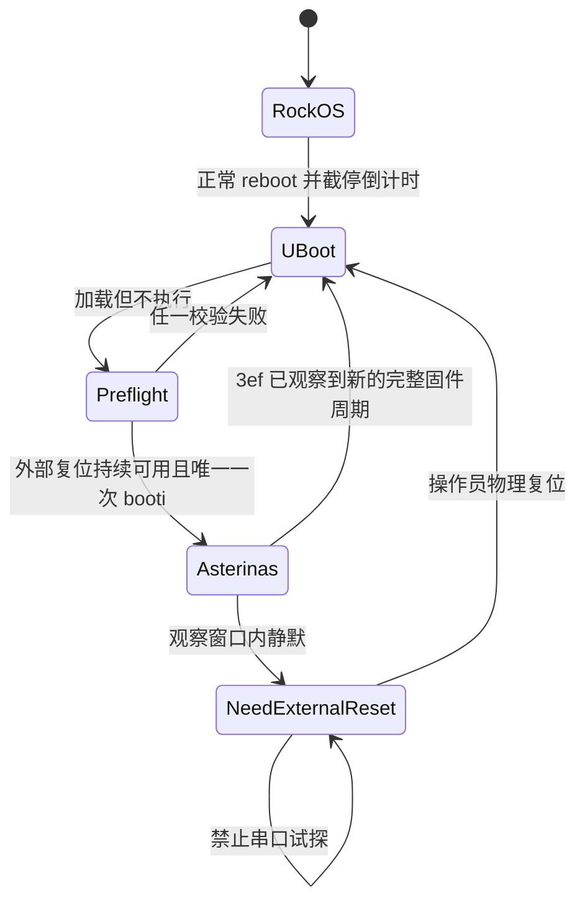

这里“外部复位可用”必须持续覆盖：

1. `booti` 之前；
2. 整个串口观察窗口；
3. 观察窗口结束后的恢复动作。

不能只在开始时确认，
随后让操作员离开现场。

## 11. 如何从串口边界定位故障

串口调试的关键不是“输出越多越好”，
而是为每个不可逆边界设计唯一 marker。

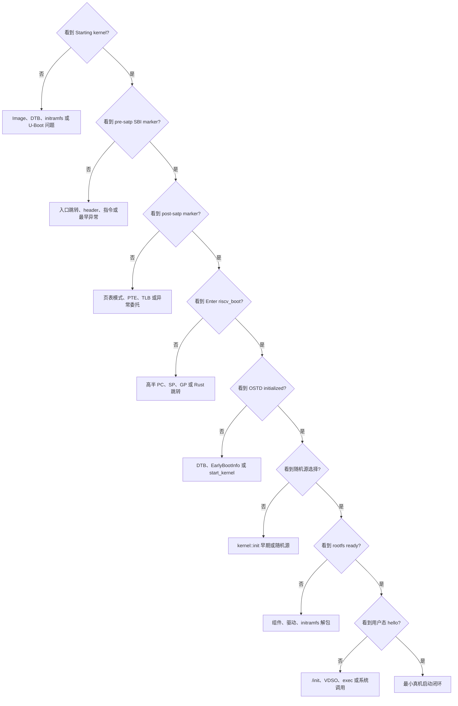

### 11.1 历史 `ae38e6c6` 真机边界

2026-07-15 的 376 字节原始日志最后是：

```text
Starting kernel ...
```

120 秒内没有：

- `Enter riscv_boot`；
- `OSTD initialized`；
- 用户态 hello；
- 自动复位。

已知的 FDT reservation warning 在 RockOS 和历史 v8 中也存在，
所以它不是当前新出现的故障边界。

这份日志只描述历史 `ae38e6c6`，不能再代表当前真机边界。

### 11.2 历史 `6df0f28f` 真机边界

2026-07-16 的默认 Sv48 运行已经观察到：

```text
Enter riscv_boot
INFO: Booting 3 processors
OSTD initialized. Preparing components.
use randomness based on the timestamp, which is insecure
[kernel] rootfs is ready
Failed to run the init process: ... ENOENT
```

因此分页入口、OSTD、SMP、组件、随机源 fallback 和 rootfs 都已经越过。
该次失败来自 U-Boot RAM 环境在 `booti` 时覆盖 DTB，使正确的 PID 1 参数
丢失。历史 clean QEMU 基线已经复现 stale 路径并验证修正路径，但它与
`6df0f28f` 不是同一 Image。这个待验证边界已经由后续 `3ef99e6bd`
受控运行越过。

### 11.3 当前 `3ef99e6bd` 真机边界

2026-07-19 的冻结候选已经观察到：

```text
first_process_diag ... user_enter
user_first_syscall id=56
write(fd=1, requested=50) result=50
```

随后，在没有操作员外部复位的受控窗口中，串口出现完整的新 DDR、OpenSBI、
U-Boot 启动序列并回到 `=>`。因此当前边界已经越过 PID 1 与第一次用户态
`write`。UART 日志中没有普通 hello；Asterinas 未接收 framebuffer，因而
也没有 HDMI 输出路径。首个缺失边界是 console route。

现场 DTB 把 UART 描述为 `snps,dw-apb-uart`、`reg-shift=2`、
`reg-io-width=4`，而当前 RISC-V UART 组件只匹配 `ns16550a`。同时 RISC-V
启动路径没有传递 framebuffer，导致 `tty0` 的 VT backend 接受并丢弃输出。
详细 provenance 与边界见
[PID 1 与恢复证据](evidence/2026-07-20-megrez-pid1-recovery.md)。

## 12. Sv48-first：已撤销的独立汇编策略

### 12.1 为什么当时优先怀疑它

`ae38e6c6` 的 `bsp_boot.S`：

1. 先构造并启用 Sv48；
2. 读回 `satp`；
3. 只有读回失败才尝试 Sv39；
4. 启用分页后切换到高半地址；
5. 最后才进入会打印 `Enter riscv_boot` 的 Rust 代码。

历史 v8 真机分支使用经过多轮 Megrez 调试的 Sv39 早期路径，
能够输出早期 SBI markers 并到达 `OSTD initialized`。
与之不同，`ae38e6c6` 的上游 Sv48-first 路径在 QEMU 成功，
但在 Megrez 上没有第一条 Rust 日志。

这三项证据共同支持“优先检查分页切换”，
但不能直接证明 Sv48 是根因。
此后强制 Svade 的 QEMU 失败把 A/D 位暴露为另一项具体问题，
当前分支已经修复它；随后 `6df0f28f` 默认 Sv48 真机到达 rootfs，
把 Sv48-first 从当前主嫌疑降为历史诊断分支。

### 12.2 为什么不能直接大改页表

可能性仍包括：

- U-Boot 传入寄存器与假设不一致；
- Sv48 `satp` 写入被接受，但页表 walker 行为不同；
- PTE 的 A/D 位、叶子层级或地址宽度不符合 EIC7700 实现；
- 高半 PC、SP 或 GP 计算有问题；
- 分页后的异常没有被委托到 S-mode；
- SBI 控制台本身在该边界不可用。

如果未来新候选重新停在 Rust 入口前，正确做法仍是先增加最小 marker，
而不是一次性移植历史分支的全部启动代码。

### 12.3 何时才重新测试 Sv39-first

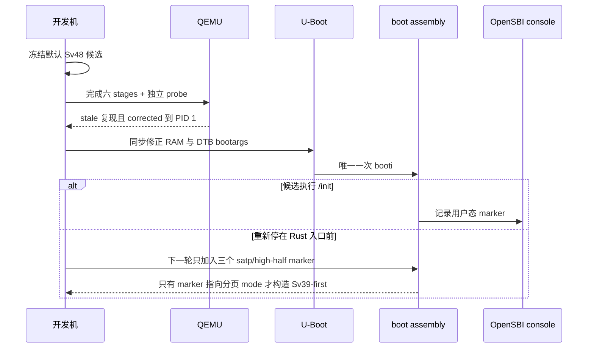

该决策树只保留为历史诊断记录。`b48cfeea3` 已证明“汇编探测模式、Rust
编译另一模式”本身就是错误架构。未来若候选重新在 `Enter riscv_boot`
之前静默，应构建显式 Sv39 和显式 Sv48 两个受控产物，而不是恢复运行时
Sv48-first fallback。完整故障链、Linux 的动态降级条件和防复发约束见
[Sv39/Sv48 故障复盘](evidence/2026-08-25-riscv-sv39-sv48-lessons.md)。

## 13. 随机种子在流程中的位置

随机种子是重要问题，
但它不是当前最早的阻塞点。

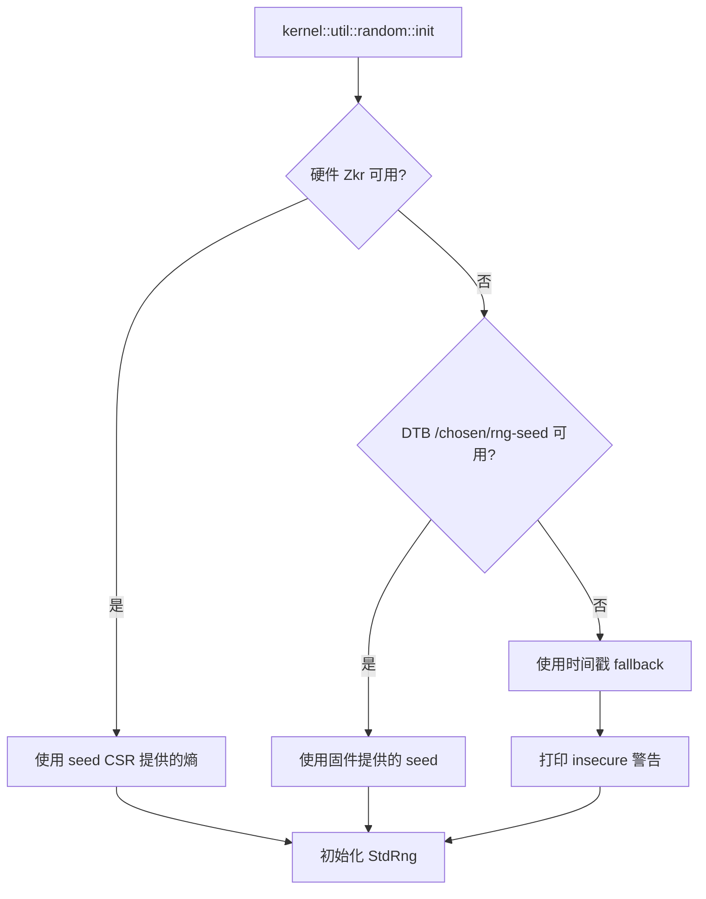

历史 v8 已经完成 OSTD 和所有注册组件，
随后停在 `kernel::init()` 早期。
源码与 DTB 显示当时实现会无条件读取 `/chosen/rng-seed`，
而 Megrez DTB 没有该属性；
这是首要的源码支持诊断，但没有通过单变量修复实验闭环。
当时研究 `rng-seed` 是合理的，
因为它是紧邻最后边界的第一个具体候选。

当前协作分支已经实现以下顺序：

1. 硬件 Zkr；
2. DTB `rng-seed`；
3. 时间戳 fallback，并打印安全警告。

所以缺少 `rng-seed` 不应再导致 unwrap panic。
但是时间戳不是高质量熵源，
它只适合当前 bring-up，
不能被描述为最终安全方案。

`6df0f28f` 真机已经实际打印时间戳 fallback 警告并继续到 rootfs，证明
缺少 Zkr/DTB seed 不再是启动阻塞点。当前 preflight 还主动关闭 Zkr、移除
QEMU DTB seed，并在 Svade/Svadu 两端要求同一 fallback。当前阶段关注
framebuffer handoff、console route、DesignWare UART 与 shell；熵质量是
后续安全加固，而不是再次为 bring-up 强行制造 `rng-seed`。

## 14. 历史真机进展

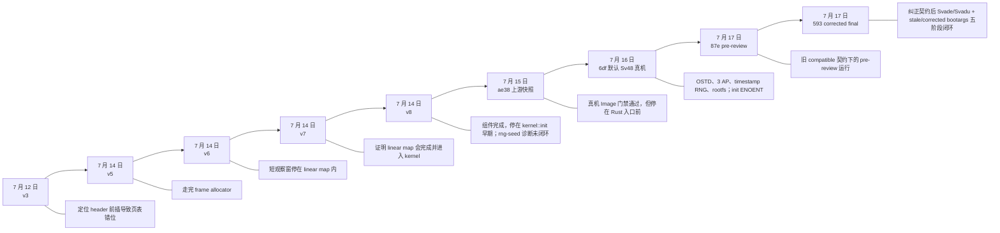

### 14.1 v3：找到了 Image 布局根因

v3 在 `satp` 切换后静默。
分析证明链接后前插 header 让根页表实际位于 `+0x1040`，
而硬件按 `+0x1000` 读取。

这一步把“硬件不兼容”的模糊猜测，
转化为可以从字节布局证明的根因。

### 14.2 v5：推进到完整 frame allocator

v5 的 marker 到达 `7`，
证明 frame allocator 初始化完成。
它把第一个未知操作缩小到 kernel page-table construction。

### 14.3 v6：观察窗太短，得出了过强结论

v6 最后看到 `l`，
当时把 initial linear map 没有返回视为潜在卡死。
后来 v7 的更长、带进度 marker 的观察证明：
这段操作只是在 16 GiB 板上非常慢，
并没有卡死。

### 14.4 v7：完成 OSTD 并否定 WDT 恢复

v7 观察到约 11.75 GiB 的 steady mapping progress，
随后完成 kernel page table、OSTD 初始化并进入 kernel。

同一轮也做出了一个重要反证：
即使 WDT counter 在递减，
板子仍没有在 705 秒内回到 U-Boot。

### 14.5 v8：组件完成，停在 `kernel::init()`

v8 的所有注册组件都返回，
日志到达 `{K+init}`，
随后 SBI cold reset。

源码和 DTB 共同指向：
当时实现无条件读取 `/chosen/rng-seed`，
而 Megrez DTB 没有该属性。

### 14.6 `ae38e6c6`：包装闭环，真机停于早期入口前

`ae38e6c6` 把当时的上游 ELF 正确转换为 `booti` Image，
并通过 QEMU 和所有真机加载门禁。

但唯一一次真机运行只到 `Starting kernel ...`。
这说明该快照解决了包装问题，
却没有重新建立历史 v8 已经拥有的 Megrez 早期启动能力。

### 14.7 `c5ae1755e`：A/D 与真实 U-Boot QEMU 基础

按实验时间，在 `ae38e6c6` 真机运行之后完成的当前独立集成线加入了
启动页表、内核映射、用户页 fault repair 的 A/D 位处理，
并新增固定 U-Boot 版本的 QEMU 集成测试。
当时的运行执行一次真实 `booti` 并到达唯一用户态 marker，进程清理也通过。

这显著降低了 Image、U-Boot 命令链和 Svade 软件路径的风险，
但当时仍没有运行 EIC7700 或 Megrez DTB。

### 14.8 `6df0f28f`：默认 Sv48 真机到 rootfs

该轮冻结的默认 Sv48 Image 由 Megrez U-Boot 接受，Asterinas 打印
`Enter riscv_boot`，从 boot hart 2 启动另外三个 hart，完成 OSTD 与组件，
使用时间戳随机源并解包 rootfs。最终 init ENOENT 证明阻塞点已经移动到
PID 1。后续分析确认只改 DTB bootargs 不够：U-Boot RAM 环境会在 `booti`
时覆盖它。

### 14.9 `87e33235`：pre-review QEMU preflight

该轮在 4-hart、2 GiB、默认 Sv48 下分别覆盖 Svade/Svadu，并完成 stale 与
corrected bootargs 路径，但使用了误含 `milkv,megrez` 的旧 compatible 契约。
它只保留为 pre-review 历史证据，不再是可交接的 clean 候选。

### 14.10 `593d5bb19`：纠正契约后的历史五阶段 preflight 基线

该历史 clean QEMU 基线纠正 compatible 顺序并修复资源、进程清理和证据门禁后，
重新完成 candidate、direct Svade、direct Svadu、U-Boot stale bootargs 与
U-Boot corrected bootargs 五个 stage。负向路径精确得到
`EXPECTED_INIT_ENOENT`，正向路径经真实通用 U-Boot `booti` 到达用户态
marker，所有 stage 均证明进程组清理完成。它解决的是模拟闭环，不等于
该 Image 已经上板。

## 15. 我们犯过哪些错误

本次本地会话从 7 月 12 日持续到 7 月 15 日，
包含 80 条用户消息、数百条进度更新和大量工具操作。
问题并不只在代码，
也包括范围控制、实验设计和沟通方式。

### 15.1 错误总览

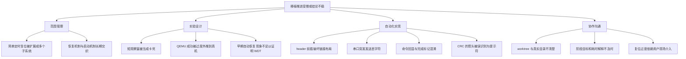

### 15.2 决策与范围错误

| 错误 | 影响 | 后来如何纠正 | 以后采用的规则 |
|---|---|---|---|
| 把“基础定时复位”逐步扩展成 QMP 控制器、信号安全、硬件 WDT 和多套恢复路径 | 用户多次追问为什么一个简单需求耗时很久 | 最终把 QEMU reset harness 与真机恢复分开，WDT 降级为诊断 | 开始前先写一行“最小交付物”，额外安全工程单列为后续任务 |
| 恢复机制与 Asterinas 启动调试长期交织 | 主线目标不清楚，复位研究占用大量注意力 | 后期明确“外部复位是门禁，启动边界是主任务” | 恢复能力只作为前置条件，不与每个内核 bug 同时开发 |
| 上游迁移时保留了 QEMU 能力，却没有先保住真机已验证的早期 marker 基线 | `ae38e6c6` 从 v8 的 OSTD 边界回退到 `Starting kernel ...` | 通过唯一一次真机运行暴露覆盖缺口 | rebase 后先做分层差异清单：QEMU、Image、真机早期、OSTD、用户态分别重验 |

### 15.3 实验设计错误

| 错误 | 证据 | 教训 |
|---|---|---|
| 用过短的串口窗口判断大内存线性映射卡死 | v6 14 秒窗口停在 `l`，v7 长窗口证明 11.75 GiB 映射持续前进并最终返回 | 慢不是死锁；长循环需要进度 marker，而不是只加 timeout |
| 把早期“像是恢复”的现象视为 WDT 可信线索 | v7 在严格验证 WDT counter 后仍观察 705 秒无复位 | 必须观察到新固件 banner 和 U-Boot prompt，才能声明独立硬复位成功 |
| 认为 QEMU 的 Sv48 路径可以直接代表 EIC7700 | QEMU 到 PID 1，`ae38e6c6` 真机却没有 `Enter riscv_boot` | 虚拟 CPU 只验证软件模型；分页 mode、异常和固件交互必须真机单独验证 |
| 确认外部复位时只关注 `booti` 当下 | 当前测试结束后用户暂时无法触碰真机 | 恢复人员必须在整个测试及测试后保持可用 |

### 15.4 实现错误

#### 错误一：Image header 前插

这是破坏启动正确性的根本实现错误。
它已经通过链接内 header、链接器断言和真实 ELF 测试修正。

#### 错误二：U-Boot 串口突发发送

当前 RockOS 启动命令第一次只回显到 `/e`。
控制器随后使用单个 `Ctrl-C` 清空未提交半行，
再以逐字符节流发送，
成功进入 RockOS。

以后必须默认 U-Boot 串口没有可靠的长命令流控。

#### 错误三：把命令回显当作完成输出

Linux shell 会回显输入。
如果完成 marker 的完整文本已经出现在命令本身，
状态机可能在命令尚未执行时提前返回。

修正方法是动态构造 marker，
让完整 marker 只出现在命令输出中，
不出现在输入文本里。

#### 错误四：提示符匹配过宽

CRC 输出包含：

```text
==> 542e838a
```

状态机曾把其中的 `=> ` 当作 U-Boot prompt，
从而截断 CRC。

正确条件是匹配新行开头：

```text
\r\n=>␠
```

其中 `␠` 表示一个空格。

#### 错误五：期望字符串不精确

控制器一度期望 `MilkV Megrez`，
实际 DTB model 是 `Milk-V Megrez`。
这是低风险错误，
但说明所有 gate 都要显示实际值，
不能只给一个模糊的 PASS/FAIL。

#### 错误六：只修改 DTB bootargs

`6df0f28f` 真机轮次把 `init=/init` 写进了 DTB，却没有同步修正 U-Boot
RAM 环境。`booti` 随后用旧环境覆盖 `/chosen/bootargs`，系统已到 rootfs
却因 init ENOENT 失败。修正不是持久化环境，而是在每次受控启动中同时
设置 RAM 环境和 DTB，并在跳转前打印证明两者逐字相等。该负向机制后来
被真实 U-Boot/QEMU stage 精确回归。

### 15.5 协作与沟通错误

#### 工作目录和 worktree 不透明

会话一开始用户就无法找到此前工作的目录，
随后又发现仍在 worktree 下。
这说明代理没有在每次恢复任务时明确报告：

- 实际仓库绝对路径；
- 当前分支；
- 是否处于 worktree；
- 未提交文件属于谁；
- 下一次从哪里继续。

当前工作位于仓库根目录，
协作者不应依赖任何一台开发机的绝对路径：

```text
<repository-root>
```

#### 状态汇报没有一直围绕“最后成功边界”

用户多次询问：

- 当前进展是什么；
- 还要多久；
- 下一步需要用户做什么；
- 为什么简单任务做了这么久。

更好的汇报模板应该始终只有六项：

| 项目 | 应回答的问题 |
|---|---|
| 目标 | 这一轮只想证明什么？ |
| 已过边界 | 最后一条可靠证据是什么？ |
| 当前假设 | 只保留哪个可证伪假设？ |
| 下一实验 | 只改变什么变量？ |
| 用户动作 | 是否真的需要用户介入？ |
| 停止条件 | 什么情况下一定不继续？ |

## 16. 我们做对了哪些事

尽管过程曲折，
这次开发形成了多项值得保留的工程方法。

### 16.1 把不可见的早期启动变成可定位边界

v5 到 v8 逐步增加 marker，
把“板子黑屏”拆成：

- DTB 校验；
- `satp`；
- frame allocator；
- kernel page-table construction；
- OSTD；
- component initialization；
- `kernel::init()`。

这使每次真机实验都能淘汰一组假设。

### 16.2 用 TDD 和链接器断言保护 Image 布局

当前 `booti` 工具有：

- 合成 ELF 布局测试；
- 真实 ELF 集成测试；
- 缺失符号和错位测试；
- 原子替换失败测试；
- Image 头字段测试；
- 根页表固定偏移测试。

链接器还断言：

- `_start == 0x80200000`；
- `.boot` 的 LMA 正确；
- Sv48 root 位于 `+0x1000`；
- Sv39 root 位于 `+0x3000`。

这避免重演 v3 的 64 字节错位。

### 16.3 QEMU 先于真机

新的候选先在隔离 QEMU 中通过 Svade/Svadu、stale bootargs 负向回归和
corrected U-Boot 正向路径，才被允许传到开发板。

QEMU 不能证明板级正确，
但能挡住大量与硬件无关的错误，
显著减少需要外部复位的真机尝试。

### 16.4 不覆盖旧产物

每次镜像使用新文件名，
先下载到 `/tmp`，
哈希一致后才安装到 `/boot`。

历史已知镜像、RockOS 和 extlinux 配置均被保留。
这使板子在能够复位时仍有已知可用的恢复入口。

### 16.5 实验时完整冻结产物身份和原始证据

`ae38e6c6` 真机实验当时完成了：

- 开发机 SHA-256；
- 板端临时文件 SHA-256；
- 板端 `/boot` SHA-256；
- U-Boot CRC32；
- Image header word dump；
- 页表关键 word dump；
- 原始串口日志；
- 证据清单 SHA-256。

所以该历史失败不是“传错文件”的猜测，
而是一个已经越过传输和 U-Boot 门禁的早期执行问题。

原始串口、build/controller 中间日志和二进制产物仍保存在本地实验归档，
但出于体积与去敏边界没有整体纳入 Git。
协作分支只提交结论摘要、原始文件哈希和一份注明来源哈希的规范化串口摘录；
这足以追踪结论来源，但不等于远程仓库包含全部原始证据。

### 16.6 对真实硬件保持了安全边界

历史 `ae38e6c6` 真机测试：

- 没有写固件；
- 没有格式化存储；
- 没有 `saveenv`；
- 没有再次写 WDT shared clock/reset 寄存器；
- 只执行一次 `booti`；
- Asterinas 静默后没有发送试探字符；
- 观察窗口结束后释放串口并请求外部复位。

这不能消除板子暂时不可达的运营成本，
但避免了在未知状态上继续叠加风险。

### 16.7 凭据处理保持克制

历史登录数据只在内存中读取并发送。
密码没有写进新命令、终端输出或新日志。

## 17. 下一阶段的开发路线

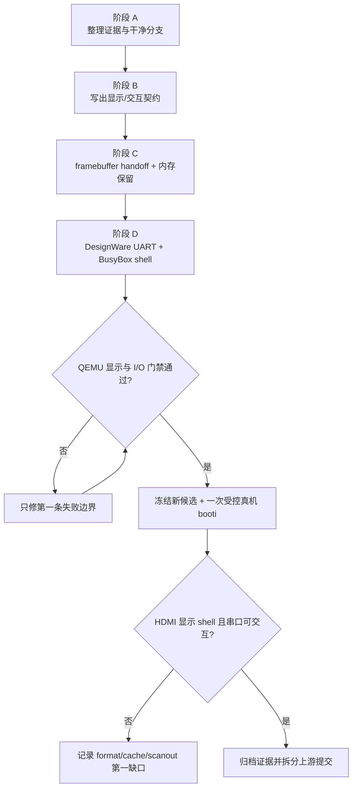

### 阶段 A：整理证据与干净分支

先提交 `3ef99e6bd` 真机 PID 1/恢复结果，保持历史提交 SHA 不变，并从
交接 HEAD 创建独立显示 console 分支。原始串口和大体积产物继续保留在
ignored 本地工作区，Git 只记录哈希、结论和适用边界。

### 阶段 B：冻结今天的验收契约

当日最小闭环是：HDMI 显示 Asterinas shell；串口输入
`echo DISPLAY_OK`、`pwd`、`uname -m`，结果在屏幕可见。USB 键盘不混入
这次变更。

### 阶段 C：建立 framebuffer handoff

优先复用 U-Boot 初始化的 scanout，通过标准 framebuffer 描述传入地址、
尺寸和格式；Asterinas 必须把该范围从 frame allocator 中保留，并使用
RISC-V 实际支持的 cache policy。完整 Eswin DRM 不属于这一步。

### 阶段 D：建立串口输入与交互 shell

按真实 DT 合同支持 `snps,dw-apb-uart`、`reg-shift=2`、
`reg-io-width=4`，先保持固件配置，只做有界收发。用现有 RISC-V BusyBox
initramfs 提供 shell，并把串口输入的会话输出路由到 `tty0`。

### 阶段 E：QEMU 集成门禁

QEMU 分别验证 DT 解析、framebuffer 内存保留、映射不 panic、VT 像素
变化、shell 输入输出与进程清理。QEMU 失败时只处理第一条失败边界，不把
页表、随机源或 PID 1 重新纳入无证据排查。

### 阶段 F：一次受控真机验证与拆分

QEMU 通过后才冻结候选，并在外部恢复持续可用时执行一次 `booti`。真机只
回答 U-Boot scanout 是否保持、像素格式/stride/cache 是否正确，以及 shell
是否可交互。闭环后：

- 移除不再需要的单字符 marker；
- 把 Megrez 特定策略放到明确的配置边界；
- 补充正式板级文档和 CI；
- 审查是否能推广到其他 RISC-V 平台。

## 18. 2026-07-19 PID 1 / 恢复 Runbook（历史）

以下清单归档 `3ef99e6bd` 受控实验的安全契约，供审计和严格复现；它不是
下一轮显示 console 实验可以直接粘贴的当前命令。下一轮必须重新冻结
commit、产物、DTB 修改和验收条件。

### 18.1 开始前

- [ ] QEMU 工作完成后已重新获得本轮用户授权，未沿用早先真机会话授权；
- [ ] 操作员在整个实验和实验后都能物理复位板子；
- [ ] 可达的外部复位或断电重启路径已实际确认；不可达即硬停止；
- [ ] 当前串口设备身份已重新确认；
- [ ] 串口没有第二个所有者；
- [ ] 当前分支和 commit 已记录；
- [ ] tracked worktree 没有意外改动；
- [ ] 当前分支的六 stages 和独立 suppression probe 全部符合预期且清理完成；
- [ ] 当前候选已按[专用软件恢复 QEMU/U-Boot 测试](../../tools/riscv/README.md#dedicated-software-reboot-qemuuboot-test)
  完成 timer 与 panic 双场景 QEMU 恢复验证；
- [ ] candidate manifest 的 HEAD、dirty 状态、Image/initramfs 身份已归档；
- [ ] Image、initramfs 和 DTB 身份已冻结；
- [ ] 新文件名不会覆盖旧镜像；
- [ ] WDT0 保持禁用且不被宣传为恢复保障。

### 18.2 RockOS 阶段

- [ ] 逐字符发送已知 `sysboot` 命令；
- [ ] 选择 RockOS 菜单项 1；
- [ ] 检查 `/boot` 是预期 ext4 分区；
- [ ] 检查剩余空间；
- [ ] 下载到本次 run 专用 `/tmp`；
- [ ] 临时文件 SHA-256 与开发机一致；
- [ ] 以新名字安装到 `/boot`；
- [ ] 执行 `sync`；
- [ ] `/boot` 再算 SHA-256；
- [ ] 正常 reboot 并截停 U-Boot。

### 18.3 U-Boot 阶段

- [ ] `version` 与历史基线一致；
- [ ] `bdinfo` 的 DRAM 和保留区已重新检查；
- [ ] SD 设备为 `mmc 1`；
- [ ] Image 字节数、CRC32 和 header 一致；
- [ ] Sv48/Sv39 根页表关键 word 与开发机一致；
- [ ] DTB model 为 `Milk-V Megrez`；
- [ ] RAM 环境 `bootargs` 为 `cpu_no_boost_1_6ghz loglevel=info init=/init asterinas.first_process_diag=1 asterinas.reboot_after=400`；
- [ ] `/chosen/bootargs` 为同一精确值，且与 RAM 环境逐字相等；
- [ ] `serial0` 已解析到实际 UART node，并记录其每个 compatible 字符串、`reg-shift` 和 `reg-io-width`；
- [ ] 该 node 不能匹配当前 NS16550A 驱动，否则停止在 `booti` 前；
- [ ] bootargs 中没有 `root=` 或 `resume=`；
- [ ] initramfs 清单已冻结，`/init` 只写 marker 后持续等待或自旋，且不得退出；
- [ ] 不以写方式打开或挂载任何持久块设备；
- [ ] initramfs 字节数和 CRC32 一致；
- [ ] 三段加载范围不重叠；
- [ ] 没有执行 `saveenv`；
- [ ] 原始串口日志已开始耐久写入。

### 18.4 执行与观察

- [ ] 只发送一次 `booti`；
- [ ] 记录 `ASTERINAS_SOFTWARE_REBOOT_ARMED seconds=400`；
- [ ] 把 armed marker 作为串口可见的近似计时起点（实际期限在该 marker 前已武装），用户态成功也不取消观察；
- [ ] 约 400 秒后依次记录新的 OpenSBI、U-Boot banner 与 prompt；
- [ ] 未出现完整新固件序列时只报告软件恢复失败，并使用外部恢复；
- [ ] 记录 `Starting kernel`；
- [ ] 记录每个唯一 early marker；
- [ ] 记录 `Enter riscv_boot`；
- [ ] 记录 `OSTD initialized`；
- [ ] 记录随机源选择；
- [ ] 记录 `rootfs is ready`；
- [ ] 记录用户态 hello；
- [ ] 如果静默，不向 Asterinas 输入任何字符；
- [ ] handoff 后只被动采集串口，不发送任何命令或探测字符；
- [ ] 观察窗口结束后由操作员外部复位；
- [ ] 运行或恢复结束后停止采集并释放串口设备；
- [ ] 对原始日志计算 SHA-256；
- [ ] 报告第一条缺失边界，而不是同时提出多个修复。

## 19. 推荐的协作方式

后续每一轮只推进一个可证伪目标。


建议每次开始前使用下面的状态模板：

```text
本轮目标：
当前最后成功边界：
本轮唯一变化：
预期看到的下一条 marker：
需要用户做什么：
停止条件：
预计观察时间：
```

这能直接避免：

- 用户不知道代理正在做什么；
- 一个简单目标被隐式扩展；
- 复位和启动主线相互遮蔽；
- 因为没有时间预期而反复追问进展；
- 在失败后继续无边界尝试。

## 20. 证据索引

### 历史 `ae38e6c6` 真机运行

- [运行结论](../../porting/logs/megrez-upstream-ae38e6c6f279-20260715T044534Z/result.md)
- [唯一一次 `booti` 的规范化串口摘录](evidence/ae38-booti-transcript.md)
- [上游 `booti` 设计](../superpowers/specs/2026-07-15-megrez-upstream-booti-design.md)
- [上游 `booti` 实施计划](../superpowers/plans/2026-07-15-megrez-upstream-booti.md)

### 当前 `3ef99e6bd` 真机、历史 PID 1 QEMU 与软件恢复闭环

- [最新 Megrez PID 1 与软件恢复证据](evidence/2026-07-20-megrez-pid1-recovery.md)
- [默认 Sv48 真机、bootargs 根因与 clean preflight 证据](evidence/2026-07-16-megrez-sv48-bootargs.md)
- [Sv39/Sv48 故障复盘、Linux 对照与防复发约束](evidence/2026-08-25-riscv-sv39-sv48-lessons.md)
- [冻结提交 `7f691c479` 的 QEMU 软件恢复证据元数据](evidence/2026-07-18-riscv-software-reboot-qemu.md)
- [RISC-V U-Boot Image 与复现命令](../../tools/riscv/README.md)
- [Megrez 高保真 preflight 设计](../superpowers/specs/2026-07-17-megrez-preflight-simulation-design.md)
- [Megrez 高保真 preflight 实施计划](../superpowers/plans/2026-07-17-megrez-preflight-simulation.md)
- [QEMU U-Boot `booti` 设计](../superpowers/specs/2026-07-16-qemu-uboot-booti-design.md)
- [QEMU U-Boot `booti` 实施计划](../superpowers/plans/2026-07-16-qemu-uboot-booti.md)
- [截至 `f831cca63` 的 A/D 与 Image 集成审查](../superpowers/2026-07-15-riscv-megrez-branch-review.md)

### 历史真机运行

- [v3 根因分析](../../porting/logs/megrez-v3-20260712-boot1-analysis.md)
- [v5 结果](../../porting/logs/megrez-v5-bbf65a4064d9-20260714T042718Z/board-v5-analysis.md)
- [v6 结果](../../porting/logs/megrez-v6-569698e32230-20260714T045344Z/board-v6-analysis.md)
- [v7 结果与 WDT 反证](../../porting/logs/megrez-v7-6b075e73b29c-20260714T050947Z/board-v7-analysis.md)
- [v8 结果与 `rng-seed` 边界](../../porting/logs/megrez-v8-b60ad6cfb3cb-20260714T114751Z/board-v8-analysis.md)

### 当前源码入口

- [`booti` Image 工具](../../tools/riscv/make_booti.py)
- [RISC-V Image 工具说明](../../tools/riscv/README.md)
- [BSP boot assembly](../../ostd/src/arch/riscv/boot/bsp_boot.S)
- [RISC-V Rust boot 入口](../../ostd/src/arch/riscv/boot/mod.rs)
- [RISC-V SBI 串口](../../ostd/src/arch/riscv/serial.rs)
- [随机源策略](../../kernel/src/util/random.rs)
- [内核初始化](../../kernel/src/init.rs)
- [initramfs rootfs](../../kernel/src/fs/rootfs.rs)

## 21. 最终成功的定义

只有同一份冻结产物在一次连续真机日志中满足以下条件，
才能说“Asterinas 已经在 Megrez 上启动”：


如果只到 OSTD，
应称为“OSTD bring-up”。
如果只到内核组件，
应称为“kernel initialization bring-up”。
如果真机只到 PID 1 而没有可见 console，
应称为“Megrez 用户态入口闭环，显示与交互尚未闭环”。

当前最准确的表述是：

> `3ef99e6bd` 已在 Megrez 真机经默认 Sv48 进入 PID 1，并完成第一次
> 50 字节用户态 `write`；同一受控会话随后观察到新的 OpenSBI、U-Boot 与
> prompt。UART 日志仍未出现普通 hello，且 Asterinas 未接收 framebuffer；
> 当前阻断已收敛为 framebuffer handoff、DesignWare UART、交互 shell 与
> 输入路由。下一候选应先在 QEMU
> 验证这些边界，再做一次具备独立恢复能力的受控真机 `booti`。
