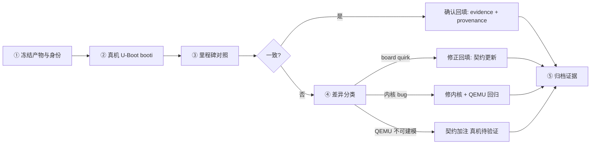

# RISC-V 真机验证回填流程

> 状态：设计文档，待评审。
>
> 配套文档：[RISC-V 开发板 QEMU 模拟测试方法论](riscv-qemu-board-methodology.md)。
> 本页回答一个问题：**QEMU 验证通过后，真机结果如何回填 MachineContract？**

## 1. 为什么需要回填

QEMU 验证（尤其是 `CONTRACT_APPROXIMATION` 层级）证明的是"软件契约在
QEMU 模型下成立"。真机验证有两个目的：

1. **确认**：QEMU 模型的板级假设（UART 地址、时钟、中断、内存）与真实
   silicon 一致；
2. **修正**：真机暴露的差异（board quirk）回填进 MachineContract，让
   后续的 QEMU 模拟更接近真机。

没有回填，QEMU 验证就停留在"一次性实验"，无法积累板级知识。

## 2. 回填的两种方向

| 方向 | 含义 | 触发条件 |
|------|------|---------|
| **确认（Confirm）** | 真机结果与 QEMU 里程碑一致 | 无差异或差异已在契约预期内 |
| **修正（Revise）** | 真机暴露 QEMU 未建模的差异 | 里程碑不一致、UART/时钟/中断行为不同 |

### 确认方向的产出

- evidence 页记录真机运行（产物哈希、串口日志哈希、里程碑结果）；
- MachineContract 的 `provenance` 字段追加真机验证引用；
- 如果 `fidelity=CONTRACT_APPROXIMATION` 且真机全通过，可考虑升级为
  `BOARD_MODEL`（如果 QEMU 有对应板型）或保持并标注"真机已确认"。

### 修正方向的产出

- 差异记录（见第 4 节决策表）；
- MachineContract 字段更新（如 `uboot_defconfig`、`dtb_filename`、
  `provenance`）；
- 如果差异是内核 bug，则修内核，不动契约；
- 如果差异是 QEMU 无法建模的硬件行为，契约加注"真机待验证"标记。

## 3. 回填流程（五步）



### 第一步：冻结产物与身份

与 QEMU 验证使用**同一个产物**（OSDK 生成的 Image，同哈希）：

| 项目 | 说明 |
|------|------|
| Git commit | 内核源码提交 |
| Image SHA-256 / CRC32 | 与 QEMU 验证对比 |
| initramfs SHA-256 / CRC32 | 同上 |
| DTB 身份 | 真机 DTB 的 model/compatible、大小、CRC |
| 串口配置 | 设备、波特率、8N1 |
| 恢复能力 | 外部复位/断电可达，贯穿整个实验 |

**规则**：QEMU 验证和真机验证必须用同一份字节。任何差异都要重新
冻结、重新验证。

### 第二步：真机 U-Boot booti

- 只执行一次 `booti`；
- bootargs 只写 RAM（不 `saveenv`），与 QEMU 验证的 bootargs 逐字一致；
- 记录 `Starting kernel ...` 及之后的全部串口输出。

### 第三步：里程碑对照

用与 QEMU 相同的 ValidationScenario 里程碑链逐段对照：

| 里程碑 | QEMU 观察 | 真机观察 | 判定 |
|--------|-----------|---------|------|
| `Enter riscv_boot` | 出现 | 出现/缺失 | |
| `OSTD initialized` | 出现 | 出现/缺失 | |
| `rootfs is ready` | 出现 | 出现/缺失 | |
| userspace marker | 出现 | 出现/缺失 | |

每段里程碑对照独立判定，不做整体 PASS/FAIL 推断。

### 第四步：差异分类

真机与 QEMU 的差异按以下决策表分类：

| 差异类型 | 判定 | 行动 |
|---------|------|------|
| UART 地址/compatible 不同 | board quirk | 内核已按 DTB 动态匹配；契约 `provenance` 记录 |
| 时钟频率不同 | board quirk | 内核从 DTB `timebase-frequency` 读取；记录 |
| 中断编号不同 | board quirk | 同上 |
| 寄存器语义不同（如 DW APB shifted） | QEMU 不可建模 | 契约加注"真机待验证"；不尝试在 QEMU 模拟 |
| 内核行为与 QEMU 不同 | **可能是内核 bug** | 修内核，QEMU 回归后再上真机 |
| 内存布局差异 | 契约不准确 | 更新 `memory`/`memory_bytes`/`mmu_types` |

### 第五步：归档证据

每轮真机验证归档：

- `docs/porting/evidence/YYYY-MM-DD-<board>-<topic>.md`：
  产物身份、串口日志 SHA-256、里程碑对照表、差异分类结论；
- MachineContract `provenance` 追加验证引用；
- 更新 `docs/porting/asterinas-riscv-status.md` 的状态表
  （"previously verified" → "currently verified" 规则见该文件）。

## 4. 回填对 QEMU 契约的影响

### 契约升级路径

```
CONTRACT_APPROXIMATION（virt + 定制 DTB）
    ↓ 真机确认全部里程碑
BOARD_MODEL（QEMU 有对应板型时）
    ↓ QEMU 板型模型改进
VIRTUAL_PLATFORM → 已不再需要板级契约（架构级通用）
```

**注意**：`BOARD_MODEL` 需要 QEMU 有对应的板型（如 `sifive_u`），且
QEMU 模型本身经 Linux 对照验证。仅凭真机通过不能把契约升级为
`BOARD_MODEL`——那需要 QEMU 侧的支持。

### 回填示例（虚构）

```python
MEGREZ_SVADE_FAST_MACHINE = MachineContract(
    ...
    fidelity=Fidelity.CONTRACT_APPROXIMATION,
    provenance=(
        "QEMU virt with a contract DTB approximating Milk-V Megrez; "
        "physical board confirmed on 2026-07-16 (sv48 boot, rootfs, "
        "init ENOENT); DW APB UART reg-shift=2 semantics are not "
        "modeled by QEMU and remain physical-board-verified"
    ),
)
```

## 5. 与 QEMU 模拟测试方法论的关系

| 阶段 | 负责方 | 产出 |
|------|--------|------|
| QEMU 模拟验证 | 自动化（`qemu_uboot_booti.py`） | PASS + 里程碑证据 |
| Linux 对照 | 自动化 | QEMU 模型正确性 |
| 真机验证 | 受控人工 | 里程碑对照 + 差异分类 |
| **回填** | 人工 + 契约更新 | MachineContract 修订 + evidence |

真机验证不是终点，而是**契约的反馈环**：每轮真机验证让 MachineContract
更准确，让下一轮的 QEMU 模拟更可信。这就是"QEMU 第一现场，真机最终
确认"的完整闭环。
